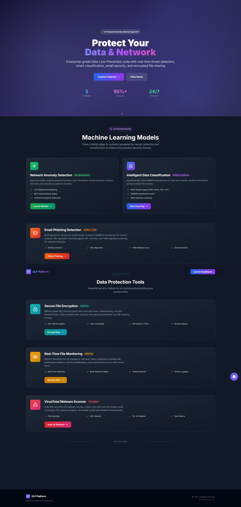

# 🛡️ Aegis DLP - Unified Data Loss Prevention Platform

A comprehensive **enterprise-grade cybersecurity platform** that combines **7 integrated security modules** into a single unified web application — protecting organizations from phishing attacks, network intrusions, data leakage, malware threats, unauthorized file access, and more.


---

## 📋 Table of Contents

- [Overview](#overview)
- [Features](#features)
- [System Architecture](#system-architecture)
- [Tech Stack](#tech-stack)
- [Project Structure](#project-structure)
- [Installation](#installation)
- [Configuration](#configuration)
- [Usage](#usage)
- [How It Works](#how-it-works)
- [Models & Training](#models--training)
- [API Endpoints](#api-endpoints)
- [Screenshots](#screenshots)
- [Author](#author)
- [License](#license)

---

## 🎯 Overview

**Aegis DLP** is a unified Data Loss Prevention system that protects organizations from multiple security threats through an integrated web dashboard:

| # | Module | Description | Status |
|---|--------|-------------|--------|
| 1 | **Phishing Email Detection** | AI-powered email analysis with Gmail/Outlook integration | ✅ Active |
| 2 | **Network Anomaly Detection (IDS)** | Real-time network traffic monitoring and intrusion detection | ✅ Active |
| 3 | **Sensitive Data Classification** | ML-based file scanning to prevent data leakage | ✅ Active |
| 4 | **File Monitoring System** | Real-time file system activity tracking with threat detection | ✅ Active |
| 5 | **File Encryption/Decryption** | AES-256 encryption with self-destruct and view-only modes | ✅ Active |
| 6 | **Malware Scanner** | VirusTotal API integration with 70+ antivirus engines | ✅ Active |
| 7 | **Agentic RAG AI Assistant** | Intelligent security assistant powered by Groq LLM | ✅ Active |

Built as a real-time web application with Socket.IO for live updates, this system provides a **comprehensive security solution** for modern organizations.

---

## ✨ Features

### 🎣 Phishing Email Detection
- **Gmail & Outlook Integration** — OAuth 2.0 authentication for secure email access
- **AI-Powered Classification** — RoBERTa + LoRA fine-tuned model (~503MB) for text analysis
- **Multi-Factor Scoring System** — Weighted analysis combining 5 different risk factors:
  - AI Body Analysis (40% weight)
  - URL Analysis (25% weight)
  - Attachment Analysis (15% weight)
  - Content Heuristics (10% weight)
  - Sender Trust (10% weight)
- **URL Analysis** — Checks links against 1M+ trusted domains database (top-1m.csv)
- **Attachment Scanning** — YARA rules for malware detection + CNN for image classification
- **Document Sensitivity** — Classifies PDF, DOCX, CSV, Excel attachments
- **Real-time Dashboard** — View analyzed emails with confidence scores and explanations
- **User Feedback System** — Improve model accuracy with user corrections

### 🔍 Network Anomaly Detection (IDS)
- **Live Packet Capture** — Real-time network monitoring using Scapy
- **18 Network Flow Features** — Comprehensive feature extraction including:
  - Duration, protocol, service, flag, src/dst bytes
  - Connection counts, service rates, error rates
  - Destination host statistics
- **MLP Classifier** — Trained machine learning model for anomaly detection
- **Real-time Predictions** — Socket.IO powered live updates
- **Statistics Dashboard** — Visual representation of normal vs anomaly traffic
- **Traffic Generator** — Built-in traffic simulator for testing

### 📁 Sensitive Data Classification
- **Multi-Format Support** — TXT, DOCX, PDF, CSV, XLSX, XLS files
- **RoBERTa Classification** — Deep learning model for text sensitivity analysis
- **Majority Voting** — Handles long documents by analyzing sentence chunks (>500 tokens)
- **Tabular Data Analysis** — Generates descriptive sentences from CSV/Excel columns
- **Directory Scanning** — Recursive file system scanning
- **Progress Tracking** — Real-time scan progress with Socket.IO

### 👁️ File Monitoring System
- **Real-time Tracking** — Monitors file system events as they happen using Watchdog
- **Event Detection** — Tracks CREATE, DELETE, MODIFY, MOVE/RENAME operations
- **Threat Detection** — Ransomware extension detection (.encrypted, .locked, .crypto, etc.)
- **Bulk Change Detection** — Alerts on rapid file changes (potential ransomware attack)
- **Severity Classification** — INFO, WARNING, CRITICAL event levels
- **File Category Filtering** — Filter by documents, images, code, executables, etc.
- **Activity Logging** — Maintains detailed event history (1000 events)

### 🔐 File Encryption/Decryption
- **AES-256 Encryption** — Industry-standard Fernet encryption
- **Password Protection** — Optional password-based key derivation (PBKDF2)
- **Self-Destruct Timer** — Files auto-delete after 30s, 1m, 2m, 5m, or 10m
- **View-Only Mode** — Decrypted files viewable in browser with watermarks (no download)
- **Batch Processing** — Encrypt/decrypt multiple files at once
- **QR Code Generation** — Share encryption keys via QR codes
- **Supported View Types** — Images, PDFs, text files, code files
- **In-Memory Storage** — Files stored temporarily in RAM (5-minute expiry)

### � Malware Scanner (VirusTotal Integration)
- **70+ Antivirus Engines** — Leverages VirusTotal's comprehensive malware detection
- **File Scanning** — Upload files up to 32MB for deep analysis
- **URL Scanning** — Check URLs, domains, and IP addresses for threats
- **Threat Level Classification** — Safe, Low, Medium, High risk categorization
- **Scan History** — Persistent history of all scans with statistics
- **Direct VirusTotal Links** — Link to full reports on VirusTotal
- **API Status Monitoring** — Real-time API connection status
- **Detection Statistics** — Malicious, suspicious, harmless, and undetected counts

### �🤖 Agentic RAG AI Assistant
- **LLM-Powered** — Groq API with llama-3.1-8b-instant model
- **Security-Aware Tools** — Queries phishing, anomaly, and classification modules
- **Context-Aware Responses** — Understands which page user is on
- **Conversation Memory** — ChromaDB vector storage for chat history
- **Activity Tracking** — Logs user security activities
- **Real-time Chat** — WebSocket-based instant responses

---

## 🏗️ System Architecture

```
┌──────────────────────────────────────────────────────────────────────────────────┐
│                        🌐 Web Interface (Flask + Socket.IO)                       │
│                              app.py (2872 lines)                                  │
├──────────────────────────────────────────────────────────────────────────────────┤
│                                                                                   │
│  ┌─────────────┐ ┌─────────────┐ ┌─────────────┐ ┌─────────────┐ ┌─────────────┐ │
│  │  Phishing   │ │  Network    │ │    Data     │ │    File     │ │    File     │ │
│  │  Detection  │ │    IDS      │ │Classification│ │  Monitoring │ │ Encryption  │ │
│  └──────┬──────┘ └──────┬──────┘ └──────┬──────┘ └──────┬──────┘ └──────┬──────┘ │
│         │               │               │               │               │        │
│  ┌──────▼──────┐ ┌──────▼──────┐ ┌──────▼──────┐ ┌──────▼──────┐ ┌──────▼──────┐ │
│  │RoBERTa+LoRA │ │  MLP Model  │ │  RoBERTa    │ │  Watchdog   │ │Fernet AES   │ │
│  │+CNN+YARA    │ │  (sklearn)  │ │  +LoRA      │ │  Library    │ │ -256        │ │
│  └─────────────┘ └─────────────┘ └─────────────┘ └─────────────┘ └─────────────┘ │
│                                                                                   │
│  ┌───────────────────────────────────────────────────────────────────────────┐   │
│  │                    🤖 Agentic RAG AI Assistant                             │   │
│  │         Groq LLM + ChromaDB + Security Query Tools                        │   │
│  └───────────────────────────────────────────────────────────────────────────┘   │
│                                                                                   │
├──────────────────────────────────────────────────────────────────────────────────┤
│                    💾 Storage Layer                                               │
│   emails.db (Phishing) │ feedback.db (User FB) │ chroma_db/ (Vector Store)       │
└──────────────────────────────────────────────────────────────────────────────────┘
```

---

## 🛠️ Tech Stack

| Category | Technologies |
|----------|-------------|
| **Backend** | Python 3.8+, Flask, Flask-SocketIO, SQLite3 |
| **ML/AI** | PyTorch, Transformers (RoBERTa), TensorFlow/Keras, scikit-learn, PEFT (LoRA) |
| **NLP** | HuggingFace Transformers, NLTK, langdetect, tldextract |
| **LLM/RAG** | Groq API, ChromaDB, Sentence Transformers |
| **Computer Vision** | TensorFlow/Keras CNN, Pillow |
| **Network Analysis** | Scapy, pandas |
| **Security** | YARA, OAuth 2.0, cryptography (Fernet/AES-256), PBKDF2 |
| **APIs** | Gmail API, Microsoft Graph API, Groq API, VirusTotal API |
| **File System** | watchdog, Windows API |
| **Frontend** | HTML5, CSS3, JavaScript, Socket.IO Client |
| **Document Processing** | PyPDF2, python-docx, openpyxl, BeautifulSoup4 |
| **Utilities** | qrcode, requests |

---

## 📂 Project Structure

```
AegisDLP/
│
├── app.py                              # Main Flask application (~3300 lines)
├── requirements.txt                    # Python dependencies
├── README.md                           # This documentation
├── LICENSE                             # MIT License
│
├── # ═══════════════════════════════════════════════════════════════
├── # 📁 MODELS - All Machine Learning Models
├── # ═══════════════════════════════════════════════════════════════
├── models/
│   ├── anomaly_detection/              # Network IDS models
│   │   ├── mlp_ids_model.pkl           # MLP anomaly detection model
│   │   ├── scaler.pkl                  # Feature scaler (StandardScaler)
│   │   ├── label_encoders.pkl          # Categorical encoders
│   │   └── feature_info.pkl            # Feature metadata
│   │
│   ├── data_classification/            # Sensitive data classifier
│   │   └── best_roberta_model_2.2M_1_Epoc.pt  # RoBERTa model (~502MB)
│   │
│   ├── phishing_detection/             # Email phishing classifier
│   │   └── roberta_lora_phishing_detector.pt  # RoBERTa+LoRA model (~503MB)
│   │
│   └── image_model/                    # Image classification
│       └── image_model.h5              # CNN model for attachments (~82MB)
│
├── # ═══════════════════════════════════════════════════════════════
├── # 📁 DATABASES - SQLite & Vector Databases  
├── # ═══════════════════════════════════════════════════════════════
├── databases/
│   ├── emails.db                       # Phishing emails database
│   ├── feedback.db                     # User feedback database
│   ├── malware_scans.db                # Malware scan history
│   └── chroma_db/                      # ChromaDB vector store
│       └── chroma.sqlite3              # Vector embeddings storage
│
├── # ═══════════════════════════════════════════════════════════════
├── # 📁 DATA - Data Files & Resources
├── # ═══════════════════════════════════════════════════════════════
├── data/
│   ├── top-1m.csv                      # Trusted domains (1M+ domains)
│   ├── yara_rules/                     # YARA malware rules
│   │   └── rules/                      # 400+ detection rules
│   └── *.csv                           # Captured network traffic data
│
├── # ═══════════════════════════════════════════════════════════════
├── # 📁 MODULES - Python Security Modules
├── # ═══════════════════════════════════════════════════════════════
├── modules/
│   ├── __init__.py                     # Package initialization
│   ├── data_classifier.py              # RoBERTa file sensitivity classifier
│   ├── body_classifier.py              # RoBERTa phishing body classifier
│   ├── phishing_document_classifier.py # Document attachment classifier
│   ├── file_monitor.py                 # Watchdog file system monitor
│   ├── malware_scanner.py              # VirusTotal API integration
│   ├── monitor.py                      # Scapy packet capture
│   └── traffic.py                      # Traffic generator for testing
│
├── # ═══════════════════════════════════════════════════════════════
├── # 📁 AGENTIC - AI Assistant Package
├── # ═══════════════════════════════════════════════════════════════
├── agentic/
│   ├── __init__.py                     # Package initialization
│   ├── agent.py                        # SecurityAgent (Groq LLM)
│   ├── memory.py                       # ConversationMemory, ActivityTracker
│   └── tools/                          # Security query tools
│       ├── __init__.py
│       ├── base.py                     # Base tool class
│       ├── search.py                   # Search utilities
│       └── security.py                 # Query tools for all modules
│
├── # ═══════════════════════════════════════════════════════════════
├── # 📁 TEMPLATES - HTML Templates (Jinja2)
├── # ═══════════════════════════════════════════════════════════════
├── templates/
│   ├── index.html                      # Landing page / Dashboard
│   ├── anomaly_detection.html          # Network IDS dashboard
│   ├── data_classification.html        # File scanner interface
│   ├── phishing_detection.html         # Email analysis setup
│   ├── phishing_dashboard.html         # Analyzed emails dashboard
│   ├── email_details.html              # Individual email view
│   ├── file_monitoring.html            # File monitoring dashboard
│   ├── file_encryption.html            # Encryption interface
│   ├── malware_scanner.html            # Malware scanner interface
│   └── encryption_viewer_*.html        # View-only mode viewers
│
├── # ═══════════════════════════════════════════════════════════════
├── # 📁 STATIC & UPLOADS
├── # ═══════════════════════════════════════════════════════════════
├── static/
│   ├── css/                            # Stylesheets
│   ├── js/                             # JavaScript files
│   └── favicon.png                     # Site favicon
│
├── uploads/
│   └── malware/                        # Temp storage for malware scans
│                                       # (Should be excluded from antivirus)
│
└── screenshots/                        # Documentation screenshots
```

---

## 🚀 Installation

### Prerequisites

- Python 3.8 or higher
- pip (Python package manager)
- Git
- Administrator privileges (for network packet capture)
- Windows OS (for file monitoring features)

### Step 1: Clone the Repository

```bash
git clone https://github.com/AyushGupta1332/AegisDLP.git
cd AegisDLP
```

### Step 2: Create Virtual Environment

```bash
python -m venv venv

# Windows
venv\Scripts\activate

# Linux/Mac
source venv/bin/activate
```

### Step 3: Install Dependencies

```bash
pip install -r requirements.txt
```

### Step 4: Download NLTK Data

```python
import nltk
nltk.download('punkt')
nltk.download('punkt_tab')
```

### Step 5: Install Npcap (Windows - Required for Network IDS)

For network packet capture functionality:
- Download and install [Npcap](https://npcap.com/#download)
- During installation, check **"Install Npcap in WinPcap API-compatible Mode"**

---

## ⚙️ Configuration

### Environment Variables

Set the following environment variables for full functionality:

```bash
# Google Gmail API Credentials
GOOGLE_CLIENT_ID=your_google_client_id
GOOGLE_CLIENT_SECRET=your_google_client_secret
GOOGLE_REDIRECT_URI=http://127.0.0.1:5000/phishing/callback

# Microsoft Outlook API Credentials
OUTLOOK_CLIENT_ID=your_outlook_client_id
OUTLOOK_CLIENT_SECRET=your_outlook_client_secret
OUTLOOK_REDIRECT_URI=http://localhost:5000/phishing/callback_outlook

# Groq API (for AI Assistant)
GROQ_API_KEY=your_groq_api_key

# VirusTotal API (for Malware Scanner)
VIRUS_TOTAL_API=your_virustotal_api_key
```

### Setting Environment Variables

**Windows (PowerShell):**
```powershell
setx GOOGLE_CLIENT_ID "your_client_id"
setx GOOGLE_CLIENT_SECRET "your_client_secret"
setx GROQ_API_KEY "your_groq_api_key"
setx VIRUS_TOTAL_API "your_virustotal_api_key"
```

**Windows (Command Prompt):**
```cmd
set GOOGLE_CLIENT_ID=your_client_id
set GOOGLE_CLIENT_SECRET=your_client_secret
set GROQ_API_KEY=your_groq_api_key
```

### Obtaining API Credentials

#### Gmail API:
1. Go to [Google Cloud Console](https://console.cloud.google.com/)
2. Create a new project
3. Enable Gmail API
4. Create OAuth 2.0 credentials (Web application)
5. Add authorized redirect URI: `http://127.0.0.1:5000/phishing/callback`

#### Outlook API:
1. Go to [Azure Portal](https://portal.azure.com/)
2. Register a new application in Azure AD
3. Add API permissions for Microsoft Graph (Mail.Read)
4. Create a client secret
5. Add redirect URI: `http://localhost:5000/phishing/callback_outlook`

#### Groq API:
1. Sign up at [Groq Console](https://console.groq.com/)
2. Generate an API key
3. Set as `GROQ_API_KEY` environment variable

#### VirusTotal API:
1. Sign up at [VirusTotal](https://www.virustotal.com/gui/join-us)
2. Go to your profile → API Key
3. Copy your API key (free tier: 4 requests/minute)
4. Set as `VIRUS_TOTAL_API` environment variable
5. **Important**: Add `uploads/malware/` folder to Windows Security exclusions

---

## 📖 Usage

### Starting the Application

```bash
python app.py
```

The application will start at `http://127.0.0.1:5000`

On startup, the system will:
1. Pre-load the Data Classification RoBERTa model
2. Pre-load the Phishing Detection RoBERTa model
3. Initialize all security modules
4. Display available modules in console

---

### Module 1: Phishing Email Detection

1. Navigate to **Phishing Detection** from the home page
2. Choose your email provider (Gmail or Outlook)
3. Select the number of emails to analyze (10-100)
4. Click **Connect & Analyze**
5. Authorize the application via OAuth
6. View results on the dashboard with:
   - Classification (Safe/Phishing/Needs Review)
   - Confidence scores
   - Risk factor breakdown
   - URL analysis

**Manual Analysis:**
- Paste email content directly into the text area
- Click **Analyze** to get instant results

---

### Module 2: Network Anomaly Detection (IDS)

1. Navigate to **Anomaly Detection** from the home page
2. Click **Start Monitoring**
   - Starts the traffic generator
   - Begins packet capture with Scapy
   - Runs real-time ML predictions
3. Watch real-time predictions appear on the dashboard
4. Monitor Normal vs Anomaly statistics
5. Click **Stop Monitoring** to end the session

> ⚠️ **Note:** Run with **administrator privileges** for packet capture.

---

### Module 3: Data Classification Scanner

1. Navigate to **Data Classification** from the home page
2. Enter the directory path to scan (e.g., `C:\Documents\sensitive-files`)
3. Click **Start Scan**
4. Watch files being classified in real-time
5. View results with:
   - Sensitivity labels (Sensitive/Non-Sensitive)
   - Confidence percentages
   - File metadata

**Supported File Types:** `.txt`, `.pdf`, `.docx`, `.csv`, `.xlsx`, `.xls`

---

### Module 4: File Monitoring System

1. Navigate to **File Monitoring** from the home page
2. Add directories to watch using the input field
3. Click **Start Monitoring**
4. View real-time events:
   - **CREATED** — New files/folders added
   - **DELETED** — Files/folders removed
   - **MODIFIED** — File content changes
   - **MOVED** — Files renamed or moved
5. Events are color-coded by severity (INFO/WARNING/CRITICAL)
6. Filter events by file category (documents, images, code, etc.)

> ⚠️ **Note:** This module uses Watchdog and works best on Windows.

---

### Module 5: File Encryption/Decryption

**To Encrypt:**
1. Navigate to **File Encryption** from the home page
2. Select file(s) to encrypt (drag & drop or browse)
3. Optional settings:
   - Password protection (uses PBKDF2 key derivation)
   - Self-destruct timer (30s to 10min)
   - View-only mode (prevents download after decryption)
4. Click **Encrypt**
5. Download encrypted files and save the encryption key

**To Decrypt:**
1. Upload encrypted file(s)
2. Paste the encryption key (or enter password)
3. Click **Decrypt**
4. View files in browser (if view-only) or download

---

### Module 6: AI Security Assistant

The AI assistant is available on every page via the chat interface:

1. Click the chat icon in the bottom-right corner
2. Ask security-related questions:
   - "What's the current phishing detection status?"
   - "How many anomalies were detected today?"
   - "Summarize my security posture"
   - "Explain this phishing email's risk factors"
3. The AI uses RAG to query relevant module data
4. Responses include tool usage information

---

## 🔬 How It Works

### Phishing Detection Pipeline

```
Email Input
    │
    ▼
┌─────────────────────────────────────────────────────────────┐
│ 1. WHITELIST CHECK — Check sender against top-1m.csv       │
│    └── If trusted → SAFE (exit)                             │
├─────────────────────────────────────────────────────────────┤
│ 2. LANGUAGE DETECTION — Non-English → Needs Review          │
├─────────────────────────────────────────────────────────────┤
│ 3. AI BODY ANALYSIS (40% weight)                            │
│    └── RoBERTa + LoRA → Phishing probability [0-1]         │
├─────────────────────────────────────────────────────────────┤
│ 4. URL ANALYSIS (25% weight)                                │
│    └── Check URLs against trusted domains                   │
├─────────────────────────────────────────────────────────────┤
│ 5. ATTACHMENT ANALYSIS (15% weight)                         │
│    ├── YARA rules scan                                      │
│    ├── CNN image classification                             │
│    └── RoBERTa document classification                      │
├─────────────────────────────────────────────────────────────┤
│ 6. CONTENT HEURISTICS (10% weight)                          │
│    └── Suspicious keywords: urgent, verify, password...     │
├─────────────────────────────────────────────────────────────┤
│ 7. SENDER TRUST (10% weight)                                │
│    └── Suspicious TLDs: .xyz, .biz, .click...              │
├─────────────────────────────────────────────────────────────┤
│ 8. FINAL CLASSIFICATION                                      │
│    ├── Score ≥ 0.90 → SAFE                                  │
│    ├── Score ≥ 0.35 → PHISHING                              │
│    └── Score < 0.35 → NEEDS REVIEW                          │
└─────────────────────────────────────────────────────────────┘
```

### Network IDS Pipeline

```
Network Interface → Scapy Sniff → Extract 18 Features → MLP Model → Normal/Anomaly
    │                                                         │
    └── traffic.py (test traffic generator)                   └── Socket.IO → Dashboard
```

### Data Classification Pipeline

```
Directory → Find Files → Extract Text → RoBERTa Classification → Sensitive/Non-Sensitive
                             │
                             ├── Short docs: Direct classification
                             └── Long docs: Majority voting across chunks
```

---

## 🧠 Models & Training

### 1. Phishing Email Body Classifier

| Attribute | Value |
|-----------|-------|
| Base Model | `FacebookAI/roberta-base` |
| Fine-tuning | LoRA (Low-Rank Adaptation) |
| Parameters | r=16, alpha=32, dropout=0.1 |
| Target Modules | query, value |
| Output | Binary (Safe/Phishing) |
| Model Size | ~503 MB |
| File | `roberta_lora_phishing_detector.pt` |

### 2. Network Anomaly Detection Model

| Attribute | Value |
|-----------|-------|
| Model Type | Multi-Layer Perceptron (MLP) |
| Framework | scikit-learn |
| Features | 18 network flow features |
| Output | Binary (Normal/Anomaly) |
| Preprocessing | StandardScaler + LabelEncoders |
| Files | `mlp_ids_model.pkl`, `scaler.pkl`, `label_encoders.pkl` |

### 3. Image Attachment Classifier

| Attribute | Value |
|-----------|-------|
| Model Type | Convolutional Neural Network (CNN) |
| Framework | TensorFlow/Keras |
| Input Size | 150x150 RGB |
| Output | Binary (Sensitive/Non-Sensitive) |
| Model Size | ~82 MB |
| File | `image_model.h5` |

### 4. Data Classification Model

| Attribute | Value |
|-----------|-------|
| Base Model | `FacebookAI/roberta-base` |
| Fine-tuning | LoRA |
| Strategy | Majority voting for documents >500 tokens |
| Output | Binary (Sensitive/Non-Sensitive) |
| File | `Data Classification File and Model/best_roberta_model_2.2M_1_Epoc.pt` |

---

## 🔌 API Endpoints

### General Routes

| Method | Endpoint | Description |
|--------|----------|-------------|
| GET | `/` | Landing page |
| GET | `/anomaly-detection` | Network IDS dashboard |
| GET | `/data-classification` | File scanner page |
| GET | `/phishing-detection` | Phishing analysis page |
| GET | `/file-monitoring` | File monitoring dashboard |
| GET | `/file-encryption` | Encryption interface |

### Network Anomaly Detection

| Method | Endpoint | Description |
|--------|----------|-------------|
| POST | `/api/start` | Start monitoring |
| POST | `/api/stop` | Stop monitoring |
| GET | `/api/stats` | Get detection statistics |
| GET | `/api/recent` | Get recent predictions |

### Data Classification

| Method | Endpoint | Description |
|--------|----------|-------------|
| POST | `/api/classify/start` | Start directory scan |
| POST | `/api/classify/stop` | Stop scanning |
| GET | `/api/classify/stats` | Get classification stats |
| GET | `/api/classify/results` | Get classification results |

### Phishing Detection

| Method | Endpoint | Description |
|--------|----------|-------------|
| POST | `/api/phishing/analyze` | Analyze email manually |
| GET | `/api/phishing/stats` | Get phishing statistics |
| GET | `/api/phishing/emails` | Get analyzed emails |
| GET | `/phishing/authorize_gmail` | Start Gmail OAuth |
| GET | `/phishing/authorize_outlook` | Start Outlook OAuth |
| GET | `/phishing/dashboard` | View analyzed emails |
| GET | `/phishing/email/<id>` | View email details |
| POST | `/phishing/feedback/<id>` | Submit feedback |

### File Monitoring

| Method | Endpoint | Description |
|--------|----------|-------------|
| POST | `/api/file-monitor/start` | Start file monitoring |
| POST | `/api/file-monitor/stop` | Stop file monitoring |
| POST | `/api/file-monitor/add-directory` | Add directory to watch |
| POST | `/api/file-monitor/remove-directory` | Remove directory |
| GET | `/api/file-monitor/events` | Get recent events |
| GET | `/api/file-monitor/stats` | Get statistics |
| GET | `/api/file-monitor/status` | Get monitoring status |

### File Encryption

| Method | Endpoint | Description |
|--------|----------|-------------|
| POST | `/encryption/encrypt` | Encrypt files |
| POST | `/encryption/decrypt` | Decrypt files |
| GET | `/encryption/download/<token>` | Download encrypted file |
| POST | `/encryption/download-zip` | Download as ZIP |
| GET | `/encryption/view/<token>` | View decrypted file |
| POST | `/encryption/generate-qr` | Generate QR code for key |
| GET | `/encryption/file-info/<token>` | Get file info |

### AI Chat

| Method | Endpoint | Description |
|--------|----------|-------------|
| POST | `/api/chat` | Send message to AI |
| GET | `/api/chat/history` | Get conversation history |
| POST | `/api/chat/clear` | Clear history |

### Activity Tracking

| Method | Endpoint | Description |
|--------|----------|-------------|
| POST | `/api/activity/log` | Log activity |
| GET | `/api/activity/summary` | Get activity summary |
| GET | `/api/activity/recent` | Get recent activities |

---

## 📸 Screenshots

### Landing Page


### Phishing Detection Dashboard


### Network Anomaly Detection


### Data Classification Scanner


---

## 🚀 Future Improvements

- [ ] USB Device Monitoring and Control
- [ ] VirusTotal API integration for malware analysis
- [ ] Role-Based Access Control (RBAC)
- [ ] Email notification system for alerts
- [ ] Docker containerization
- [ ] API rate limiting and authentication
- [ ] Export reports to PDF/Excel
- [ ] Dashboard customization

---

## 👨‍💻 Author

**Ayush Gupta**

- B.Tech AI & ML Student (2nd Year)
- GitHub: [@AyushGupta1332](https://github.com/AyushGupta1332)
- LinkedIn: [Ayush Raj](https://www.linkedin.com/in/ayush-raj-144b2325a/)

---

## 📄 License

This project is licensed under the MIT License - see the [LICENSE](LICENSE) file for details.

---

## 🙏 Acknowledgments

- [HuggingFace Transformers](https://huggingface.co/transformers/) for RoBERTa models
- [PEFT Library](https://github.com/huggingface/peft) for LoRA implementation
- [Awesome YARA](https://github.com/InQuest/awesome-yara) for YARA rules
- [Scapy](https://scapy.net/) for packet manipulation
- [Flask-SocketIO](https://flask-socketio.readthedocs.io/) for real-time communication
- [Watchdog](https://python-watchdog.readthedocs.io/) for file system monitoring
- [Groq](https://groq.com/) for LLM inference
- [ChromaDB](https://www.trychroma.com/) for vector storage
- [Cryptography](https://cryptography.io/) for encryption utilities

---

*Aegis DLP - Protecting your data, one threat at a time.* 🛡️
