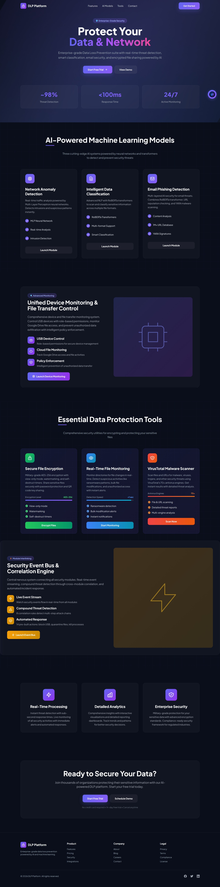
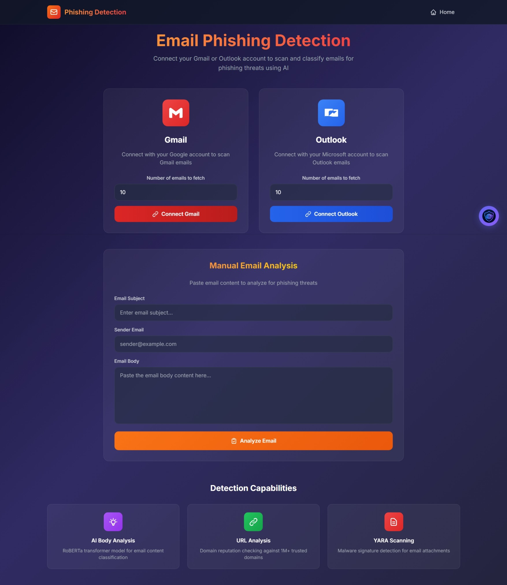
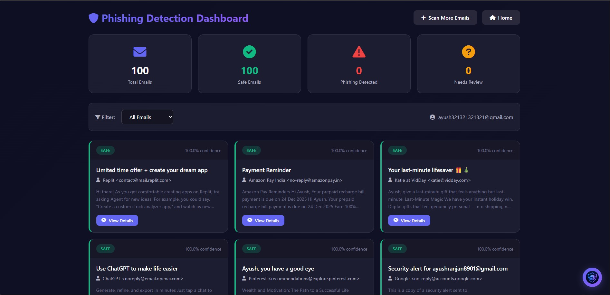
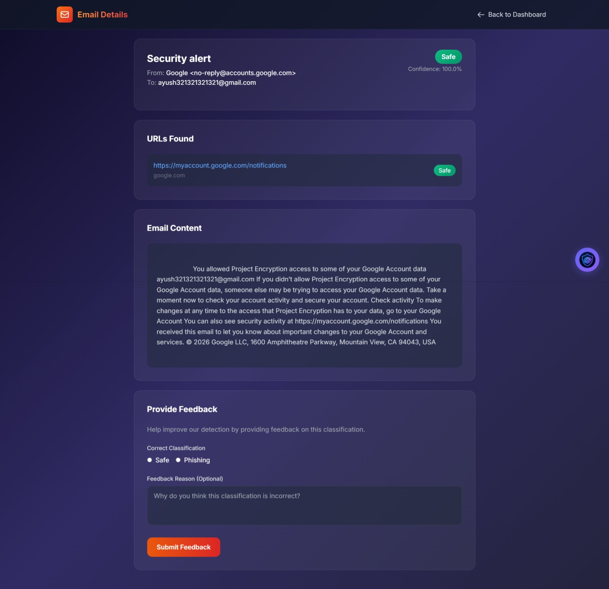
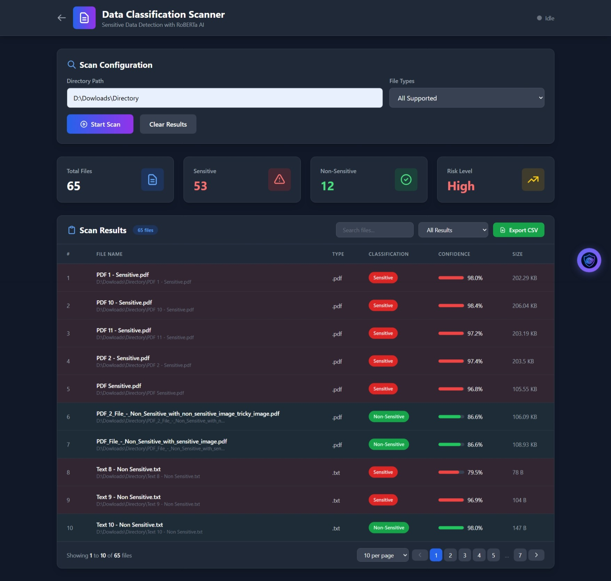
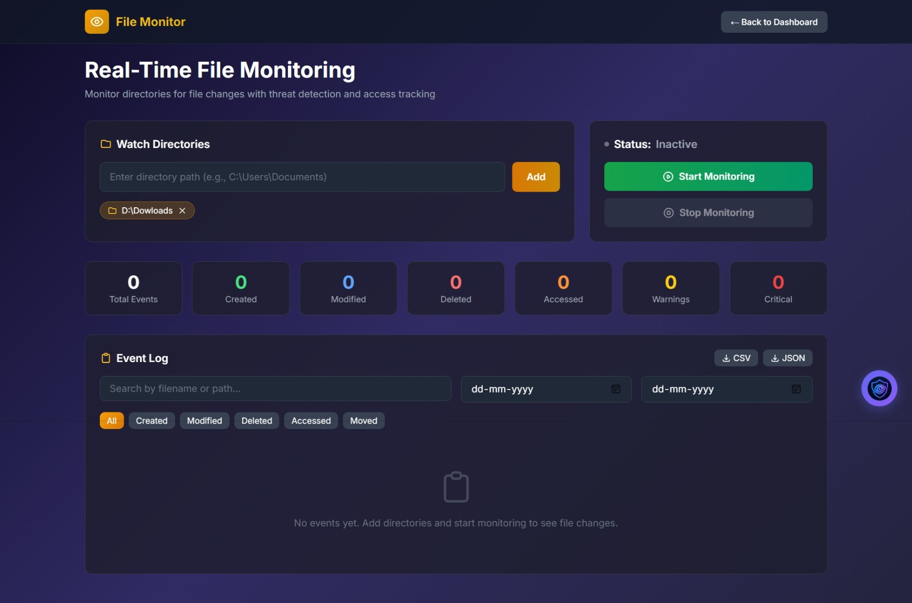
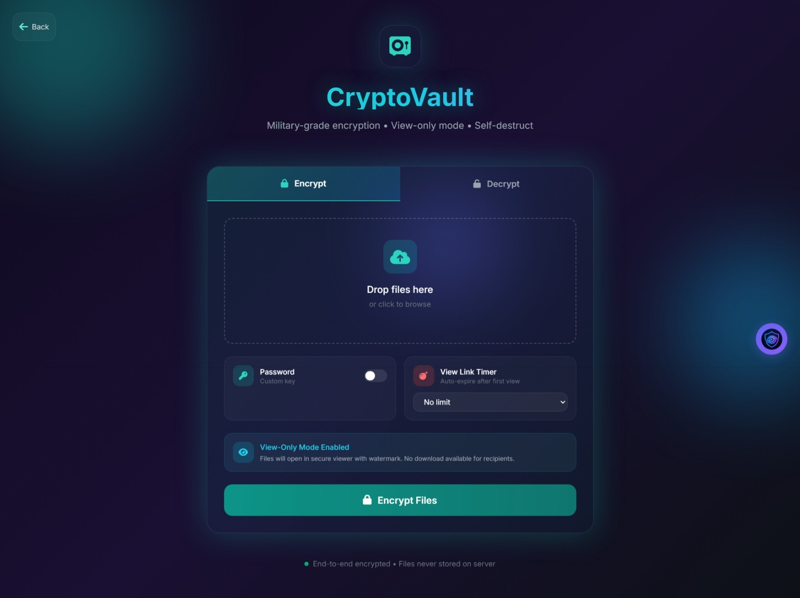
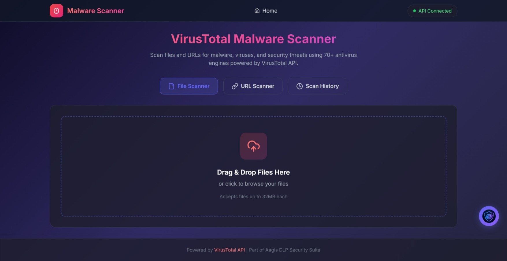
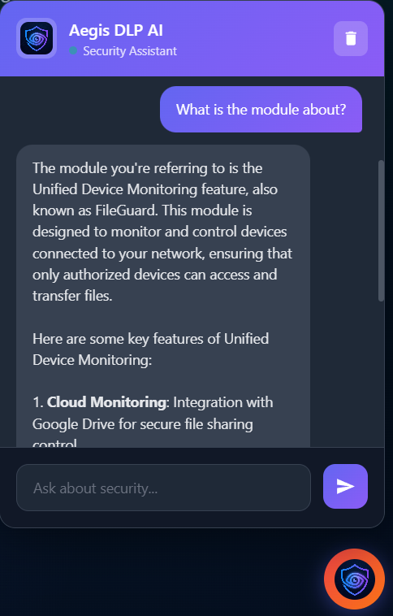
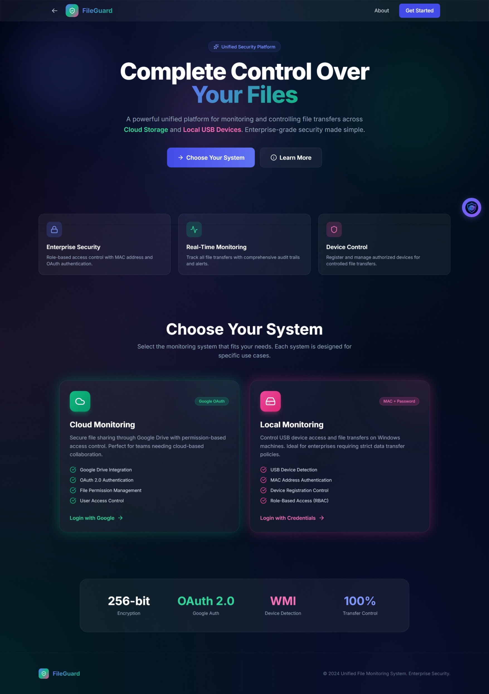

# 🛡️ Aegis DLP - Unified Data Loss Prevention Platform

A comprehensive **enterprise-grade cybersecurity platform** that combines **9 integrated security modules** into a single unified web application — protecting organizations from phishing attacks, network intrusions, data leakage, malware threats, unauthorized file access, and more. All modules are **interconnected via a central Event Bus** for real-time threat correlation and automated response.


---

## 📋 Table of Contents

- [Overview](#overview)
- [Features](#features)
- [System Architecture](#system-architecture)
- [Tech Stack](#tech-stack)
- [Project Structure](#project-structure)
- [Installation](#installation)
- [Configuration](#configuration)
- [Usage](#usage)
- [How It Works](#how-it-works)
- [Models & Training](#models--training)
- [API Endpoints](#api-endpoints)
- [Screenshots](#screenshots)
- [Author](#author)
- [License](#license)

---

## 🎯 Overview

**Aegis DLP** is a unified Data Loss Prevention system that protects organizations from multiple security threats through an integrated web dashboard:

| # | Module | Description | Status |
|---|--------|-------------|--------|
| 1 | **Phishing Email Detection** | AI-powered email analysis with Gmail/Outlook integration | ✅ Active |
| 2 | **Network Anomaly Detection (IDS)** | Real-time network traffic monitoring and intrusion detection | ✅ Active |
| 3 | **Sensitive Data Classification** | ML-based file scanning to prevent data leakage | ✅ Active |
| 4 | **File Monitoring System** | Real-time file system activity tracking with threat detection | ✅ Active |
| 5 | **File Encryption/Decryption** | AES-256-GCM encryption with self-destruct and view-only modes | ✅ Active |
| 6 | **Malware Scanner** | VirusTotal API integration with 70+ antivirus engines | ✅ Active |
| 7 | **Agentic RAG AI Assistant** | Intelligent security assistant powered by Groq LLM | ✅ Active |
| 8 | **Unified Device Monitoring & File Transfer Control** | USB device registration, cloud file monitoring, and RBAC-based file transfer control | ✅ Active |
| 9 | **Event Bus & Module Correlation** | Central event-driven architecture with real-time threat correlation, automated responses, and SQLite audit logging | ✅ Active |

Built as a real-time web application with Socket.IO for live updates, this system provides a **comprehensive security solution** with **cross-module threat correlation** for modern organizations.

---

## ✨ Features

### 🎣 Phishing Email Detection
- **Gmail & Outlook Integration** — OAuth 2.0 authentication for secure email access
- **AI-Powered Classification** — RoBERTa + LoRA fine-tuned model (~503MB) for text analysis
- **Multi-Factor Scoring System** — Weighted analysis combining 5 different risk factors:
  - AI Body Analysis (40% weight)
  - URL Analysis (25% weight)
  - Attachment Analysis (15% weight)
  - Content Heuristics (10% weight)
  - Sender Trust (10% weight)
- **Single-Factor Escalation** — Any factor ≥ 0.85 auto-escalates to Phishing (prevents scoring bypass)
- **URL Analysis** — Checks links against 1M+ trusted domains database (top-1m.csv)
- **Attachment Scanning** — YARA rules for malware detection + CNN for image classification
- **Document Sensitivity** — Classifies PDF, DOCX, CSV, Excel attachments
- **Real-time Dashboard** — View analyzed emails with confidence scores and explanations
- **User Feedback System** — Improve model accuracy with user corrections

### 🔍 Network Anomaly Detection (IDS)
- **Live Packet Capture** — Real-time network monitoring using Scapy
- **18 Network Flow Features** — Comprehensive feature extraction including:
  - Duration, protocol, service, flag, src/dst bytes
  - Connection counts, service rates, error rates
  - Destination host statistics
- **MLP Classifier** — Trained machine learning model for anomaly detection
- **Model Drift Detection** — Rolling window (500 predictions) monitors anomaly rate; warns at >40% or <0.5%
- **Subprocess Isolation** — Scapy packet capture runs in a separate process (privilege isolation from Flask)
- **Real-time Predictions** — Socket.IO powered live updates
- **Statistics Dashboard** — Visual representation of normal vs anomaly traffic
- **Traffic Generator** — Built-in traffic simulator for testing

### 📁 Sensitive Data Classification
- **Multi-Format Support** — TXT, DOCX, PDF, CSV, XLSX, XLS files
- **PII Regex Pre-Pass** — Fast regex scan for SSN, credit card, IBAN, phone, email before transformer inference (~100x faster for obvious PII)
- **RoBERTa Classification** — Deep learning model for text sensitivity analysis
- **Three-Band Confidence Enforcement** — Auto-classify (>75%), flag for review (40-75%), auto-classify (< 40%)
- **Majority Voting** — Handles long documents by analyzing sentence chunks (>500 tokens)
- **Tabular Data Analysis** — Generates descriptive sentences from CSV/Excel columns
- **Directory Scanning** — Recursive file system scanning
- **Progress Tracking** — Real-time scan progress with Socket.IO

### 👁️ File Monitoring System
- **Real-time Tracking** — Monitors file system events as they happen using Watchdog
- **Event Detection** — Tracks CREATE, DELETE, MODIFY, MOVE/RENAME operations
- **Dual-Storage** — In-memory ring buffer (1000 events) + SQLite async writer for persistence
- **File Change Verification** — Validates modification events by checking file size changes
- **File Content Hashing** — SHA-256 hashing to detect content changes
- **Process Attribution** — Identifies which process modified files (via psutil)
- **Threat Detection** — Ransomware extension detection (externalized to `data/ransomware_extensions.json`)
- **Entropy-Based Ransomware Detection** — Shannon entropy >7.5 bits triggers encryption warning
- **Per-Directory Behavioral Baseline** — Adaptive anomaly detection (5x historical average threshold)
- **Bulk Change Detection** — Alerts on rapid file changes (potential ransomware attack)
- **Severity Classification** — INFO, WARNING, CRITICAL event levels
- **Search & Filtering** — Search events by filename, path, or date range
- **Export Functionality** — Export events to CSV or JSON
- **Event Details Modal** — Click events to view full details (hash, size, process)
- **File Category Filtering** — Filter by documents, images, code, executables, etc.
- **Configurable Settings** — Save monitoring preferences via config.json

### 🔐 File Encryption/Decryption
- **AES-256-GCM Encryption** — Authenticated encryption with 32-byte keys via `cryptography.hazmat`
- **Password Protection** — PBKDF2-SHA256 key derivation with **600,000 iterations** (NIST SP 800-132)
- **Self-Destruct Timer** — Files auto-delete after 30s, 1m, 2m, 5m, or 10m
- **View-Only Mode** — Server-side PIL rendering with watermarks (cannot be bypassed via DevTools)
- **Batch Processing** — Encrypt/decrypt multiple files at once
- **Secure Key Sharing** — Single-use, time-limited HTTPS key links (replaces QR codes)
- **Backward Compatibility** — Legacy Fernet-encrypted files auto-detected and decrypted
- **Supported View Types** — Images, PDFs, text files, code files
- **In-Memory Storage** — Files stored temporarily in RAM (5-minute expiry)

### 🦠 Malware Scanner (VirusTotal Integration)
- **YARA Local Pre-Scan** — 150+ YARA rules scanned locally before VirusTotal (instant, free, no API quota)
- **70+ Antivirus Engines** — Leverages VirusTotal's comprehensive malware detection (fallback)
- **File Scanning** — Upload files up to 32MB for deep analysis
- **URL Scanning** — Check URLs, domains, and IP addresses for threats
- **Threat Level Classification** — Safe, Low, Medium, High risk categorization
- **Scan History** — Persistent history of all scans with statistics
- **Direct VirusTotal Links** — Link to full reports on VirusTotal
- **API Status Monitoring** — Real-time API connection status
- **Detection Statistics** — Malicious, suspicious, harmless, and undetected counts

### 🤖 Agentic RAG AI Assistant
- **LLM-Powered** — Groq API with llama-3.1-8b-instant model
- **Prompt Injection Defense** — 10 regex patterns + hard delimiters around tool outputs + trusted domain filtering
- **Rate Limited** — 20 requests/minute per IP on `/api/chat` (429 response on abuse)
- **Security-Aware Tools** — Queries phishing, anomaly, and classification modules
- **Context-Aware Responses** — Understands which page user is on
- **Conversation Memory** — ChromaDB vector storage for chat history
- **Activity Tracking** — Logs user security activities
- **Real-time Chat** — WebSocket-based instant responses

### 🔌 Unified Device Monitoring & File Transfer Control
- **USB Device Identification** — WMI-based device fingerprinting (VID, PID, serial number, SHA-256 hash)
- **Device Registration** — Whitelist authorized USB devices with friendly names
- **Real-time USB Monitoring** — Instant detection of device insertion/removal via WMI events
- **File Transfer Control** — Allow/deny file transfers based on device authorization status
- **File Policy Enforcement** — Blacklists dangerous file types (.exe, .dll, .bat, .ps1, .vbs, .docm)
- **Magic-Byte File Validation** — Uses `python-magic` to detect extension spoofing (EXE renamed to PDF)
- **Archive Scanning** — Inspects ZIP contents for blocked file types before transfer
- **File Integrity Verification** — SHA-256 hash comparison after transfer
- **RBAC Access Control** — Three roles: Superadmin (full access), Admin (authorize users), User (transfer only)
- **MAC Address Authentication** — User identity tied to physical machine MAC address
- **Device Secret (2FA)** — 32-character hex token as second factor prevents MAC spoofing
- **Google Drive Integration** — OAuth 2.0 cloud file monitoring with permission control
- **Cloud Admin Panel** — Manage cloud users, permissions, and file uploads
- **Email Alerts** — Gmail SMTP notifications for blocked transfers, unregistered devices, failed logins
- **Alert Throttling** — Prevents notification floods with configurable intervals
- **Transfer Logging** — Full audit trail of all file operations
- **Vendor Detection** — Identifies USB manufacturer (SanDisk, Kingston, Samsung, Apple, etc.)
- **UBA Dashboard** — User Behavior Analytics for monitoring activity patterns

### 🔗 Event Bus & Module Correlation Engine
- **Central Event Bus** — Pub/sub message broker connecting all security modules
- **Publisher Authentication** — Modules must register allowed event types at startup; unauthorized events are logged
- **50+ Event Types** — Structured event types across 10 categories (file, network, phishing, USB, data, malware, encryption, alert, AI, system)
- **8 Pre-Defined Correlation Rules** — Compound threat detection across modules:
  1. **Phishing → Malware Chain** — Phishing email + malware detection within 1 hour
  2. **Unauthorized Data Theft** — Unauthorized USB + sensitive data within 5 minutes
  3. **Ransomware Pattern** — 50+ file modifications in 1 minute
  4. **USB + Network Anomaly** — USB insertion + network anomaly within 5 minutes
  5. **Malware C2 Communication** — Malware detection + network anomaly within 10 minutes
  6. **Bulk Sensitive Access** — 10+ sensitive files detected in 5 minutes
  7. **Brute Force Pattern** — 5+ failed auth attempts in 2 minutes
  8. **Phishing + File Execution** — Phishing email + new executable within 30 minutes
- **Configurable Thresholds** — Tune via `data/correlation_thresholds.json` without code changes
- **14 Automated Response Actions** — `block_usb`, `quarantine_file`, `kill_process`, `isolate_host`, etc.
- **Human Approval Gate** — Destructive actions (`kill_process`, `isolate_host`) require admin approval
- **SQLite Persistence** — All events and correlation matches logged for audit trail
- **Real-time Socket.IO Alerts** — Instant dashboard notifications for high-severity events
- **Event Bus Dashboard** — Dedicated page for viewing live security events and correlation matches
- **Severity-Based Filtering** — INFO, LOW, MEDIUM, HIGH, CRITICAL levels with comparison operators
- **Configurable Rules** — Enable/disable rules, adjust time windows and cooldowns

---

## 🏗️ System Architecture

```
┌──────────────────────────────────────────────────────────────────────────────────┐
│                        🌐 Web Interface (Flask + Socket.IO)                       │
│               app.py (entry point) + 9 Blueprints (~4000 lines)                   │
├──────────────────────────────────────────────────────────────────────────────────┤
│                                                                                   │
│  ┌─────────────┐ ┌─────────────┐ ┌─────────────┐ ┌─────────────┐ ┌─────────────┐ │
│  │  Phishing   │ │  Network    │ │    Data     │ │    File     │ │    File     │ │
│  │  Detection  │ │    IDS      │ │Classification│ │  Monitoring │ │ Encryption  │ │
│  └──────┬──────┘ └──────┬──────┘ └──────┬──────┘ └──────┬──────┘ └──────┬──────┘ │
│         │               │               │               │               │        │
│  ┌──────┴───────────────┴───────────────┴───────────────┴───────────────┴──────┐ │
│  │                      🔗 Central Event Bus (Pub/Sub)                         │ │
│  │  EventBus → EventLogger → CorrelationEngine → ResponseExecutor              │ │
│  │  40+ Event Types │ 8 Correlation Rules │ 14 Response Actions                │ │
│  └──────┬───────────────┬───────────────┬───────────────┬───────────────┬──────┘ │
│         │               │               │               │               │        │
│  ┌──────▼──────┐ ┌──────▼──────┐ ┌──────▼──────┐ ┌──────▼──────┐ ┌──────▼──────┐ │
│  │RoBERTa+LoRA │ │  MLP Model  │ │  RoBERTa    │ │  Watchdog   │ │ AES-256-GCM │ │
│  │+CNN+YARA    │ │  (sklearn)  │ │  +LoRA+PII  │ │  +SQLite    │ │ (AESGCM)    │ │
│  └─────────────┘ └─────────────┘ └─────────────┘ └─────────────┘ └─────────────┘ │
│                                                                                   │
│  ┌──────────────────────────────┐  ┌─────────────────────────────────────────┐   │
│  │    🤖 Agentic RAG AI         │  │  🔌 Unified Device Monitoring           │   │
│  │  Groq LLM + ChromaDB + Tools │  │  USB Control + Cloud Monitor + RBAC    │   │
│  └──────────────────────────────┘  └─────────────────────────────────────────┘   │
│                                                                                   │
│  ┌──────────────────────────────┐  ┌─────────────────────────────────────────┐   │
│  │    🦠 Malware Scanner         │  │  📊 ~15,000 lines of Python             │   │
│  │  VirusTotal API v3 + SQLite   │  │  across all modules and blueprints     │   │
│  └──────────────────────────────┘  └─────────────────────────────────────────┘   │
│                                                                                   │
├──────────────────────────────────────────────────────────────────────────────────┤
│                    💾 Storage Layer                                               │
│  emails.db │ feedback.db │ malware_scans.db │ events.db │ devices.db │ users.db  │
│  cloud_users.db │ chroma_db/ (vector store)                                      │
└──────────────────────────────────────────────────────────────────────────────────┘
```

---

## 🛠️ Tech Stack

| Category | Technologies |
|----------|-------------|
| **Backend** | Python 3.8+, Flask, Flask-SocketIO, SQLite3 |
| **ML/AI** | PyTorch, Transformers (RoBERTa), TensorFlow/Keras, scikit-learn, PEFT (LoRA) |
| **NLP** | HuggingFace Transformers, NLTK, langdetect, tldextract |
| **LLM/RAG** | Groq API, ChromaDB, Sentence Transformers |
| **Computer Vision** | TensorFlow/Keras CNN, Pillow |
| **Network Analysis** | Scapy, pandas |
| **Security** | YARA, OAuth 2.0, cryptography (AES-256-GCM), PBKDF2 (600k iterations), python-magic |
| **APIs** | Gmail API, Microsoft Graph API, Groq API, VirusTotal API |
| **File System** | watchdog, Windows API |
| **Frontend** | HTML5, CSS3, JavaScript, Socket.IO Client |
| **Document Processing** | PyPDF2, python-docx, openpyxl, BeautifulSoup4 |
| **Utilities** | requests, Pillow |

---

## 📂 Project Structure

```
AegisDLP/
│
├── app.py                              # Main Flask entry point (~178 lines)
├── requirements.txt                    # Python dependencies (40+)
├── README.md                           # This documentation
├── SECURITY_FIXES.md                   # Security audit fixes documentation
├── LICENSE                             # MIT License
├── .env                                # Environment variables (not tracked in git)
├── RESEARCH_PAPER.md                   # Research paper (Markdown)
├── RESEARCH_PAPER.pdf                  # Research paper (PDF)
├── MODULE_INTERLINKING.pdf             # Module interlinking documentation
│
├── # ═══════════════════════════════════════════════════════════════
├── # 📁 BLUEPRINTS - Flask Route Handlers (9 Modules)
├── # ═══════════════════════════════════════════════════════════════
├── blueprints/
│   ├── __init__.py                     # Blueprint registration & ALL_BLUEPRINTS list
│   ├── shared_state.py                 # AppState singleton (shared across modules)
│   ├── chatbot.py                      # AI Security Assistant routes
│   ├── classification.py              # Data Classification Scanner routes
│   ├── encryption.py                  # CryptoVault File Encryption routes
│   ├── event_bus_bp.py                # Event Bus Dashboard & API routes
│   ├── file_monitor_bp.py            # File Monitoring routes
│   ├── malware.py                     # Malware Scanner (VirusTotal) routes
│   ├── network_ids.py                 # Network IDS routes
│   ├── phishing.py                    # Phishing Email Detection routes (~937 lines)
│   └── unified_monitoring.py          # Unified Device Monitoring routes (~770 lines)
│
├── # ═══════════════════════════════════════════════════════════════
├── # 📁 MODULES - Core Security Engines
├── # ═══════════════════════════════════════════════════════════════
├── modules/
│   ├── __init__.py                     # Safe-import wrapper
│   ├── data_classifier.py              # RoBERTa file sensitivity classifier
│   ├── body_classifier.py              # RoBERTa phishing body classifier
│   ├── phishing_document_classifier.py # Document attachment classifier (from bytes)
│   ├── file_monitor.py                 # Watchdog file system monitor (~813 lines)
│   ├── malware_scanner.py              # VirusTotal API v3 wrapper
│   ├── monitor.py                      # Scapy packet capture (NSL-KDD features)
│   ├── traffic.py                      # Normal traffic generator for testing
│   └── event_bus/                      # 🔗 Event-driven module correlation
│       ├── __init__.py                 # init_event_system() wiring
│       ├── events.py                   # SecurityEvent, EventType (40+), Severity enums
│       ├── bus.py                      # EventBus pub/sub broker (async dispatch)
│       ├── correlation.py              # CorrelationEngine + 8 compound threat rules
│       ├── logger.py                   # EventLogger (SQLite persistence, WAL mode)
│       ├── responses.py                # ResponseExecutor + 14 automated handlers
│       └── test_integration.py         # Integration tests for event pipeline
│
├── # ═══════════════════════════════════════════════════════════════
├── # 📁 AGENTIC - AI Security Assistant Package
├── # ═══════════════════════════════════════════════════════════════
├── agentic/
│   ├── __init__.py                     # Package initialization
│   ├── agent.py                        # SecurityAgent (Groq LLM + tool orchestration)
│   ├── memory.py                       # ConversationMemory + ActivityTracker (ChromaDB)
│   └── tools/                          # Security query tools (9 tools)
│       ├── __init__.py
│       ├── base.py                     # Abstract BaseTool class
│       ├── search.py                   # DuckDuckGo web search tool
│       └── security.py                 # 8 module-specific query tools (~1106 lines)
│
├── # ═══════════════════════════════════════════════════════════════
├── # 📁 UNIFIED MONITORING - Device Control Subsystem
├── # ═══════════════════════════════════════════════════════════════
├── unified_monitoring_src/
│   ├── __init__.py                     # Package initialization
│   ├── alerts.py                       # Email alert manager (Gmail SMTP, throttling)
│   ├── device_identifier.py            # USB device identification via WMI
│   ├── device_registry.py              # SQLite device registration database
│   ├── file_controller.py              # File transfer controller (allow/deny logic)
│   ├── file_policy.py                  # File type blacklist/whitelist policy checker
│   ├── usb_monitor.py                  # Real-time USB insert/removal detection (WMI)
│   ├── user_manager.py                 # RBAC user management (superadmin/admin/user)
│   ├── credentials.json                # Google OAuth credentials
│   └── token.json                      # Google OAuth token
│
├── # ═══════════════════════════════════════════════════════════════
├── # 📁 MODELS - Machine Learning Models
├── # ═══════════════════════════════════════════════════════════════
├── models/
│   ├── anomaly_detection/              # Network IDS models
│   │   ├── mlp_ids_model.pkl           # MLP anomaly detection model
│   │   ├── scaler.pkl                  # Feature scaler (StandardScaler)
│   │   ├── label_encoders.pkl          # Categorical encoders
│   │   └── feature_info.pkl            # Feature metadata
│   │
│   ├── data_classification/            # Sensitive data classifier
│   │   └── best_roberta_model_2.2M_1_Epoc.pt  # RoBERTa+LoRA model
│   │
│   ├── phishing_detection/             # Email phishing classifier
│   │   └── roberta_lora_phishing_detector.pt   # RoBERTa+LoRA model
│   │
│   └── image_model/                    # Image classification
│       └── image_model.h5              # CNN model for attachments
│
├── # ═══════════════════════════════════════════════════════════════
├── # 📁 DATABASES - SQLite & Vector Databases
├── # ═══════════════════════════════════════════════════════════════
├── databases/
│   ├── emails.db                       # Phishing emails database
│   ├── feedback.db                     # User feedback database
│   ├── malware_scans.db                # Malware scan history
│   ├── chroma_db/                      # ChromaDB vector store
│   │   └── chroma.sqlite3              # Vector embeddings storage
│   ├── event_bus/                      # Event Bus persistence
│   │   └── events.db                   # Security events & correlation matches
│   ├── file_monitor/                   # File monitoring data
│   │   └── config.json                 # Monitoring configuration (directories, filters)
│   └── unified_monitoring/             # Unified monitoring databases
│       ├── cloud_permissions.json      # Cloud file permissions cache
│       ├── cloud_users.db              # Google Drive cloud users
│       ├── devices.db                  # Registered USB devices
│       └── users.db                    # RBAC users & sessions
│
├── # ═══════════════════════════════════════════════════════════════
├── # 📁 DATA - Data Files & Resources
├── # ═══════════════════════════════════════════════════════════════
├── data/
│   ├── ids_capture.csv                 # Captured network traffic data
│   ├── top-1m.csv                      # Trusted domains (1M+ domains)
│   ├── ransomware_extensions.json      # Known ransomware file extensions
│   ├── correlation_thresholds.json     # Configurable correlation rule thresholds
│   └── yara_rules/                     # YARA malware detection rules
│       └── rules/                      # 400+ detection rules
│
├── # ═══════════════════════════════════════════════════════════════
├── # 📁 TEMPLATES - HTML Templates (Jinja2)
├── # ═══════════════════════════════════════════════════════════════
├── templates/
│   ├── index.html                      # Landing page / Dashboard
│   ├── anomaly_detection.html          # Network IDS dashboard
│   ├── data_classification.html        # File scanner interface
│   ├── phishing_detection.html         # Email analysis setup
│   ├── phishing_dashboard.html         # Analyzed emails dashboard
│   ├── email_details.html              # Individual email view
│   ├── file_monitoring.html            # File monitoring dashboard
│   ├── file_encryption.html            # Encryption interface
│   ├── malware_scanner.html            # Malware scanner interface
│   ├── event_bus.html                  # Event Bus dashboard
│   ├── encryption_viewer_text.html     # View-only text viewer
│   ├── encryption_viewer_image.html    # View-only image viewer
│   ├── encryption_viewer_pdf.html      # View-only PDF viewer
│   ├── encryption_viewer_error.html    # View-only error page
│   ├── unified_home.html              # Unified monitoring home
│   ├── unified_about.html             # Unified monitoring about page
│   ├── unified_base.html              # Unified monitoring base template
│   ├── unified_cloud/                 # Cloud monitoring templates
│   │   ├── admin.html                 # Cloud admin panel
│   │   ├── dashboard.html             # Cloud dashboard
│   │   ├── files.html                 # Cloud file browser
│   │   └── login.html                 # Cloud login
│   └── unified_local/                 # Local monitoring templates
│       ├── dashboard.html             # Local device dashboard
│       └── login.html                 # Local login
│
├── # ═══════════════════════════════════════════════════════════════
├── # 📁 STATIC, UPLOADS & MISC
├── # ═══════════════════════════════════════════════════════════════
├── static/
│   ├── favicon.png                     # Site favicon
│   ├── css/
│   │   ├── back-button.css             # Back navigation styling
│   │   ├── chatbot.css                 # Chatbot widget styling
│   │   └── unified_chatbot.css         # Unified monitoring chatbot styling
│   └── js/
│       ├── back-navigation.js          # Back navigation script
│       ├── chatbot.js                  # Chatbot widget script
│       └── unified_chatbot.js          # Unified monitoring chatbot script
│
├── uploads/
│   └── malware/                        # Temp storage for malware scans
│
├── temp_uploads/                       # Temporary file upload storage
│
└── screenshots/                        # Documentation screenshots
```

---

## 🚀 Installation

### Prerequisites

- Python 3.8 or higher
- pip (Python package manager)
- Git
- Administrator privileges (for network packet capture)
- Windows OS (for file monitoring features)

### Step 1: Clone the Repository

```bash
git clone https://github.com/AyushGupta1332/AegisDLP.git
cd AegisDLP
```

### Step 2: Create Virtual Environment

```bash
python -m venv venv

# Windows
venv\Scripts\activate

# Linux/Mac
source venv/bin/activate
```

### Step 3: Install Dependencies

```bash
pip install -r requirements.txt
```

### Step 4: Download NLTK Data

```python
import nltk
nltk.download('punkt')
nltk.download('punkt_tab')
```

### Step 5: Install Npcap (Windows - Required for Network IDS)

For network packet capture functionality:
- Download and install [Npcap](https://npcap.com/#download)
- During installation, check **"Install Npcap in WinPcap API-compatible Mode"**

---

## ⚙️ Configuration

### Environment Variables

Set the following environment variables for full functionality:

```bash
# Google Gmail API Credentials
GOOGLE_CLIENT_ID=your_google_client_id
GOOGLE_CLIENT_SECRET=your_google_client_secret
GOOGLE_REDIRECT_URI=http://127.0.0.1:5000/phishing/callback

# Microsoft Outlook API Credentials
OUTLOOK_CLIENT_ID=your_outlook_client_id
OUTLOOK_CLIENT_SECRET=your_outlook_client_secret
OUTLOOK_REDIRECT_URI=http://localhost:5000/phishing/callback_outlook

# Groq API (for AI Assistant)
GROQ_API_KEY=your_groq_api_key

# VirusTotal API (for Malware Scanner)
VIRUS_TOTAL_API=your_virustotal_api_key
```

### Setting Environment Variables

**Windows (PowerShell):**
```powershell
setx GOOGLE_CLIENT_ID "your_client_id"
setx GOOGLE_CLIENT_SECRET "your_client_secret"
setx GROQ_API_KEY "your_groq_api_key"
setx VIRUS_TOTAL_API "your_virustotal_api_key"
```

**Windows (Command Prompt):**
```cmd
set GOOGLE_CLIENT_ID=your_client_id
set GOOGLE_CLIENT_SECRET=your_client_secret
set GROQ_API_KEY=your_groq_api_key
```

### Obtaining API Credentials

#### Gmail API:
1. Go to [Google Cloud Console](https://console.cloud.google.com/)
2. Create a new project
3. Enable Gmail API
4. Create OAuth 2.0 credentials (Web application)
5. Add authorized redirect URI: `http://127.0.0.1:5000/phishing/callback`

#### Outlook API:
1. Go to [Azure Portal](https://portal.azure.com/)
2. Register a new application in Azure AD
3. Add API permissions for Microsoft Graph (Mail.Read)
4. Create a client secret
5. Add redirect URI: `http://localhost:5000/phishing/callback_outlook`

#### Groq API:
1. Sign up at [Groq Console](https://console.groq.com/)
2. Generate an API key
3. Set as `GROQ_API_KEY` environment variable

#### VirusTotal API:
1. Sign up at [VirusTotal](https://www.virustotal.com/gui/join-us)
2. Go to your profile → API Key
3. Copy your API key (free tier: 4 requests/minute)
4. Set as `VIRUS_TOTAL_API` environment variable
5. **Important**: Add `uploads/malware/` folder to Windows Security exclusions

---

## 📖 Usage

### Starting the Application

```bash
python app.py
```

The application will start at `http://127.0.0.1:5000`

On startup, the system will:
1. Validate required environment variables (`GROQ_API_KEY`, `VIRUS_TOTAL_API`)
2. Pre-load the Data Classification RoBERTa model
3. Pre-load the Phishing Detection RoBERTa model
4. Initialize all security modules (Event Bus, correlation engine, response executor)
5. Display available modules in console with security status

---

### Module 1: Phishing Email Detection

1. Navigate to **Phishing Detection** from the home page
2. Choose your email provider (Gmail or Outlook)
3. Select the number of emails to analyze (10-100)
4. Click **Connect & Analyze**
5. Authorize the application via OAuth
6. View results on the dashboard with:
   - Classification (Safe/Phishing/Needs Review)
   - Confidence scores
   - Risk factor breakdown
   - URL analysis

**Manual Analysis:**
- Paste email content directly into the text area
- Click **Analyze** to get instant results

---

### Module 2: Network Anomaly Detection (IDS)

1. Navigate to **Anomaly Detection** from the home page
2. Click **Start Monitoring**
   - Starts the traffic generator
   - Begins packet capture with Scapy
   - Runs real-time ML predictions
3. Watch real-time predictions appear on the dashboard
4. Monitor Normal vs Anomaly statistics
5. Click **Stop Monitoring** to end the session

> ⚠️ **Note:** Run with **administrator privileges** for packet capture.

---

### Module 3: Data Classification Scanner

1. Navigate to **Data Classification** from the home page
2. Enter the directory path to scan (e.g., `C:\Documents\sensitive-files`)
3. Click **Start Scan**
4. Watch files being classified in real-time
5. View results with:
   - Sensitivity labels (Sensitive/Non-Sensitive)
   - Confidence percentages
   - File metadata

**Supported File Types:** `.txt`, `.pdf`, `.docx`, `.csv`, `.xlsx`, `.xls`

---

### Module 4: File Monitoring System

1. Navigate to **File Monitoring** from the home page
2. Add directories to watch using the input field
3. Click **Start Monitoring**
4. View real-time events:
   - **CREATED** — New files/folders added (🟢 Green)
   - **DELETED** — Files/folders removed (🔴 Red)
   - **MODIFIED** — File content changes (🔵 Blue)
   - **MOVED** — Files renamed or moved (🟣 Purple)
   - **ACCESSED** — Files opened for reading (🟠 Orange)
5. Events are color-coded by severity (INFO/WARNING/CRITICAL)
6. **Search events** by filename or path using the search bar
7. **Filter by date** using the date range pickers
8. **Click any event** to view full details (hash, size, process info)
9. **Export events** to CSV or JSON using the export buttons
10. Stop monitoring — events are stored in-memory (up to 1000 events)

> ⚠️ **Note:** This module uses Watchdog and psutil. Works best on Windows.
> Events are stored in-memory for fast real-time performance. File modification events are verified to filter out false positives from Windows Explorer.

---

### Module 5: File Encryption/Decryption

**To Encrypt:**
1. Navigate to **File Encryption** from the home page
2. Select file(s) to encrypt (drag & drop or browse)
3. Optional settings:
   - Password protection (uses PBKDF2 key derivation)
   - Self-destruct timer (30s to 10min)
   - View-only mode (prevents download after decryption)
4. Click **Encrypt**
5. Download encrypted files and save the encryption key

**To Decrypt:**
1. Upload encrypted file(s)
2. Paste the encryption key (or enter password)
3. Click **Decrypt**
4. View files in browser (if view-only) or download

---

### Module 6: AI Security Assistant

The AI assistant is available on every page via the chat interface:

1. Click the chat icon in the bottom-right corner
2. Ask security-related questions:
   - "What's the current phishing detection status?"
   - "How many anomalies were detected today?"
   - "Summarize my security posture"
   - "Explain this phishing email's risk factors"
3. The AI uses RAG to query relevant module data
4. Responses include tool usage information

---

### Module 7: Malware Scanner

1. Navigate to **Malware Scanner** from the home page
2. **File Scanning:**
   - Upload a file (up to 32MB)
   - The system computes SHA-256, checks existing reports, or uploads to VirusTotal
   - View results from 70+ antivirus engines with threat level classification
3. **URL Scanning:**
   - Enter a URL, domain, or IP address
   - Results show detection counts and community reputation
4. View **Scan History** with persistent records in SQLite
5. Click any scan result for a direct link to the full VirusTotal report

> ⚠️ **Note:** Free VirusTotal API allows 4 requests/minute. Add `uploads/malware/` to Windows Security exclusions.

---

### Module 8: Unified Device Monitoring

**Cloud Monitoring (Google Drive):**
1. Navigate to **Unified Monitoring** → **Cloud**
2. Sign in with Google OAuth
3. Browse connected Google Drive files
4. Admin panel: manage cloud users and file permissions
5. Upload files to monitored Drive accounts

**Local USB Monitoring:**
1. Navigate to **Unified Monitoring** → **Local**
2. Log in with username + password (MAC address verified)
3. View connected USB devices with vendor identification
4. **Register/Unregister** USB devices (Superadmin/Admin only)
5. **Transfer files** to authorized USB devices with policy checks
6. Monitor transfer logs and device activity
7. Manage users and roles (Superadmin: create/delete users, reset passwords)

> ⚠️ **Note:** Requires Windows (WMI for USB detection). Run as administrator for full device access.

---

### Module 9: Event Bus Dashboard

1. Navigate to **Event Bus** from the home page
2. View **live security events** from all modules in real-time
3. Monitor **correlation matches** — compound threat patterns detected across modules
4. View **automated response logs** — actions taken by the system
5. Toggle correlation rules on/off as needed
6. Filter events by severity, source module, or event type

---

## 🔬 How It Works

### Phishing Detection Pipeline

```
Email Input
    │
    ▼
┌─────────────────────────────────────────────────────────────┐
│ 1. WHITELIST CHECK — Check sender against top-1m.csv       │
│    └── If trusted → SAFE (exit)                             │
├─────────────────────────────────────────────────────────────┤
│ 2. LANGUAGE DETECTION — Non-English → Needs Review          │
├─────────────────────────────────────────────────────────────┤
│ 3. AI BODY ANALYSIS (40% weight)                            │
│    └── RoBERTa + LoRA → Phishing probability [0-1]         │
├─────────────────────────────────────────────────────────────┤
│ 4. URL ANALYSIS (25% weight)                                │
│    └── Check URLs against trusted domains                   │
├─────────────────────────────────────────────────────────────┤
│ 5. ATTACHMENT ANALYSIS (15% weight)                         │
│    ├── YARA rules scan                                      │
│    ├── CNN image classification                             │
│    └── RoBERTa document classification                      │
├─────────────────────────────────────────────────────────────┤
│ 6. CONTENT HEURISTICS (10% weight)                          │
│    └── Suspicious keywords: urgent, verify, password...     │
├─────────────────────────────────────────────────────────────┤
│ 7. SENDER TRUST (10% weight)                                │
│    └── Suspicious TLDs: .xyz, .biz, .click...              │
├─────────────────────────────────────────────────────────────┤
│ 8. SINGLE-FACTOR ESCALATION                                   │
│    └── If ANY factor ≥ 0.85 → force PHISHING                │
├─────────────────────────────────────────────────────────────┤
│ 9. FINAL CLASSIFICATION                                      │
│    ├── Score ≥ 0.90 → SAFE                                  │
│    ├── Score ≥ 0.35 → PHISHING                              │
│    └── Score < 0.35 → NEEDS REVIEW                          │
└─────────────────────────────────────────────────────────────┘
```

### Network IDS Pipeline

```
Network Interface → Scapy Sniff → Extract 18 Features → MLP Model → Normal/Anomaly
    │                                                         │
    └── traffic.py (test traffic generator)                   └── Socket.IO → Dashboard
```

### Data Classification Pipeline

```
Directory → Find Files → Extract Text → PII Regex Pre-Pass → RoBERTa Classification
                             │                │                       │
                             │                ├── SSN, CC, IBAN found  ├── ≥75%: Auto-classify
                             │                │   → Sensitive (100%)   ├── 40-75%: Needs Review
                             │                │                       └── <40%: Auto-classify
                             ├── Short docs: Direct classification
                             └── Long docs: Majority voting across chunks
```

---

## 🧠 Models & Training

### 1. Phishing Email Body Classifier

| Attribute | Value |
|-----------|-------|
| Base Model | `FacebookAI/roberta-base` |
| Fine-tuning | LoRA (Low-Rank Adaptation) |
| Parameters | r=16, alpha=32, dropout=0.1 |
| Target Modules | query, value |
| Output | Binary (Safe/Phishing) |
| Model Size | ~503 MB |
| File | `roberta_lora_phishing_detector.pt` |

### 2. Network Anomaly Detection Model

| Attribute | Value |
|-----------|-------|
| Model Type | Multi-Layer Perceptron (MLP) |
| Framework | scikit-learn |
| Features | 18 network flow features |
| Output | Binary (Normal/Anomaly) |
| Preprocessing | StandardScaler + LabelEncoders |
| Files | `mlp_ids_model.pkl`, `scaler.pkl`, `label_encoders.pkl` |

### 3. Image Attachment Classifier

| Attribute | Value |
|-----------|-------|
| Model Type | Convolutional Neural Network (CNN) |
| Framework | TensorFlow/Keras |
| Input Size | 150x150 RGB |
| Output | Binary (Sensitive/Non-Sensitive) |
| Model Size | ~82 MB |
| File | `image_model.h5` |

### 4. Data Classification Model

| Attribute | Value |
|-----------|-------|
| Base Model | `FacebookAI/roberta-base` |
| Fine-tuning | LoRA |
| Strategy | Majority voting for documents >500 tokens |
| Output | Binary (Sensitive/Non-Sensitive) |
| File | `Data Classification File and Model/best_roberta_model_2.2M_1_Epoc.pt` |

---

## 🔌 API Endpoints

### General Routes

| Method | Endpoint | Description |
|--------|----------|-------------|
| GET | `/` | Landing page |
| GET | `/anomaly-detection` | Network IDS dashboard |
| GET | `/data-classification` | File scanner page |
| GET | `/phishing-detection` | Phishing analysis page |
| GET | `/file-monitoring` | File monitoring dashboard |
| GET | `/file-encryption` | Encryption interface |
| GET | `/malware-scanner` | Malware scanner page |
| GET | `/event-bus` | Event Bus dashboard |
| GET | `/unified-monitoring` | Unified monitoring home |

### Network Anomaly Detection

| Method | Endpoint | Description |
|--------|----------|-------------|
| POST | `/api/start` | Start monitoring |
| POST | `/api/stop` | Stop monitoring |
| GET | `/api/stats` | Get detection statistics |
| GET | `/api/recent` | Get recent predictions |

### Data Classification

| Method | Endpoint | Description |
|--------|----------|-------------|
| POST | `/api/classify/start` | Start directory scan |
| POST | `/api/classify/stop` | Stop scanning |
| GET | `/api/classify/stats` | Get classification stats |
| GET | `/api/classify/results` | Get classification results |

### Phishing Detection

| Method | Endpoint | Description |
|--------|----------|-------------|
| POST | `/api/phishing/analyze` | Analyze email manually |
| GET | `/api/phishing/stats` | Get phishing statistics |
| GET | `/api/phishing/emails` | Get analyzed emails |
| GET | `/phishing/authorize_gmail` | Start Gmail OAuth |
| GET | `/phishing/authorize_outlook` | Start Outlook OAuth |
| GET | `/phishing/dashboard` | View analyzed emails |
| GET | `/phishing/email/<id>` | View email details |
| POST | `/phishing/feedback/<id>` | Submit feedback |

### File Monitoring

| Method | Endpoint | Description |
|--------|----------|-------------|
| POST | `/api/file-monitor/start` | Start file monitoring |
| POST | `/api/file-monitor/stop` | Stop file monitoring |
| POST | `/api/file-monitor/add-directory` | Add directory to watch |
| POST | `/api/file-monitor/remove-directory` | Remove directory |
| GET | `/api/file-monitor/events` | Get recent events |
| GET | `/api/file-monitor/events/search` | Search events with filters |
| GET | `/api/file-monitor/events/export` | Export events (CSV/JSON) |
| GET | `/api/file-monitor/event/<id>` | Get single event details |
| GET | `/api/file-monitor/stats` | Get statistics |
| GET | `/api/file-monitor/status` | Get monitoring status |
| GET | `/api/file-monitor/config` | Get configuration |
| POST | `/api/file-monitor/config` | Update configuration |

### File Encryption

| Method | Endpoint | Description |
|--------|----------|-------------|
| POST | `/encryption/encrypt` | Encrypt files |
| POST | `/encryption/decrypt` | Decrypt files |
| GET | `/encryption/download/<token>` | Download encrypted file |
| POST | `/encryption/download-zip` | Download as ZIP |
| GET | `/encryption/view/<token>` | View decrypted file |
| POST | `/encryption/key-link` | Generate single-use key link |
| GET | `/encryption/file-info/<token>` | Get file info |

### AI Chat

| Method | Endpoint | Description |
|--------|----------|-------------|
| POST | `/api/chat` | Send message to AI |
| GET | `/api/chat/history` | Get conversation history |
| POST | `/api/chat/clear` | Clear history |

### Activity Tracking

| Method | Endpoint | Description |
|--------|----------|-------------|
| POST | `/api/activity/log` | Log activity |
| GET | `/api/activity/summary` | Get activity summary |
| GET | `/api/activity/recent` | Get recent activities |

### Malware Scanner

| Method | Endpoint | Description |
|--------|----------|-------------|
| GET | `/api/malware/status` | Check VirusTotal API connection |
| POST | `/api/malware/scan/file` | Upload and scan a file |
| POST | `/api/malware/scan/url` | Scan a URL for threats |
| GET | `/api/malware/history` | Get scan history |

### Event Bus

| Method | Endpoint | Description |
|--------|----------|-------------|
| GET | `/api/events/recent` | Get recent security events |
| GET | `/api/events/stats` | Get event bus statistics |
| GET | `/api/events/health` | Health check for event bus |
| GET | `/api/events/subscriptions` | List active subscriptions |
| GET | `/api/events/correlation/rules` | List correlation rules |
| POST | `/api/events/correlation/rules/<name>/toggle` | Enable/disable a rule |
| GET | `/api/events/correlation/matches` | Get correlation matches |
| GET | `/api/events/responses/log` | Get automated response logs |
| GET | `/api/events/responses/pending` | List actions awaiting approval |
| POST | `/api/events/responses/approve` | Approve a pending action |
| POST | `/api/events/responses/deny` | Deny a pending action |

### Unified Device Monitoring (Cloud)

| Method | Endpoint | Description |
|--------|----------|-------------|
| GET | `/unified-monitoring/cloud/login` | Cloud login page |
| GET | `/unified-monitoring/cloud/auth/google` | Start Google OAuth |
| GET | `/unified-monitoring/cloud/auth/callback` | Google OAuth callback |
| GET | `/unified-monitoring/cloud/logout` | Logout |
| GET | `/unified-monitoring/cloud/dashboard` | Cloud dashboard |
| GET | `/unified-monitoring/cloud/admin` | Admin panel |
| GET/POST | `/unified-monitoring/cloud/files` | File browser & search |
| POST | `/unified-monitoring/cloud/add_user` | Add cloud user |
| POST | `/unified-monitoring/cloud/update_permissions` | Update user permissions |
| POST | `/unified-monitoring/cloud/remove_user` | Remove cloud user |
| POST | `/unified-monitoring/cloud/upload` | Upload file to Drive |
| GET | `/unified-monitoring/cloud/api/files` | Get file list (JSON) |

### Unified Device Monitoring (Local)

| Method | Endpoint | Description |
|--------|----------|-------------|
| GET | `/unified-monitoring/local/login` | Local login page |
| POST | `/unified-monitoring/local/api/auth/login` | Authenticate user |
| GET | `/unified-monitoring/local/api/auth/me` | Get current user info |
| GET | `/unified-monitoring/local/logout` | Logout |
| GET | `/unified-monitoring/local/dashboard` | Local dashboard |
| GET | `/unified-monitoring/local/api/devices` | List connected USB devices |
| GET | `/unified-monitoring/local/api/stats` | Get device statistics |
| GET | `/unified-monitoring/local/api/logs` | Get transfer logs |
| GET | `/unified-monitoring/local/api/drives` | List removable drives |
| POST | `/unified-monitoring/local/api/transfer` | Transfer file to USB |
| POST | `/unified-monitoring/local/api/register` | Register USB device |
| POST | `/unified-monitoring/local/api/unregister` | Unregister USB device |
| GET | `/unified-monitoring/local/api/users` | List users (admin) |
| POST | `/unified-monitoring/local/api/users` | Create user (admin) |
| DELETE | `/unified-monitoring/local/api/users/<id>` | Delete user |
| POST | `/unified-monitoring/local/api/users/<id>/reset-password` | Reset user password |

---

## 📸 Screenshots

### Landing Page / Dashboard


### Phishing Email Detection


### Phishing Detection Dashboard


### Email Details View


### Network Anomaly Detection (IDS)


### Data Classification Scanner


### Real-time File Monitoring


### File Encryption Security Tool


### Malware Scanner


### AI Security Assistant (Chatbot)


### Unified File Monitoring System


---

## 🔒 Security Hardening (March 2026)

A comprehensive security audit was conducted by an independent cybersecurity expert. All critical and important findings have been remediated. See [`SECURITY_FIXES.md`](SECURITY_FIXES.md) for full details.

**Key Security Features:**
- ✅ AES-256-GCM encryption with 600k PBKDF2 iterations
- ✅ Prompt injection defense (regex + hard delimiters + domain filtering)
- ✅ Human approval gate for destructive automated responses
- ✅ Rate limiting (20 req/min) on AI chat endpoint
- ✅ PII regex pre-pass for instant sensitive data detection (SSN, CC, IBAN)
- ✅ Magic-byte file validation (prevents extension spoofing)
- ✅ Event bus publisher authentication (prevents event spoofing)
- ✅ Model drift detection for IDS anomaly classifier
- ✅ Per-directory behavioral baselines for ransomware detection
- ✅ Configurable correlation thresholds via external JSON
- ✅ Scapy packet capture isolated in subprocess (privilege separation)
- ✅ YARA local first-pass malware scanning (removes hard API dependency)
- ✅ Device secret (2FA) for MAC address authentication

---

## 🚀 Future Improvements

- [x] ~~USB Device Monitoring and Control~~ ✅ Implemented
- [x] ~~VirusTotal API integration for malware analysis~~ ✅ Implemented
- [x] ~~Role-Based Access Control (RBAC)~~ ✅ Implemented (File Transfer Control)
- [x] ~~Email notification system for alerts~~ ✅ Implemented (File Monitoring)
- [x] ~~Event Bus & Module Correlation~~ ✅ Implemented (8 rules, 14 responses)
- [x] ~~API rate limiting and authentication~~ ✅ Implemented (chat rate limiter + publisher auth)
- [x] ~~Security hardening~~ ✅ Full audit remediation (24 fixes across 19 files)
- [ ] Docker containerization
- [x] ~~Export reports to PDF/Excel~~ ✅ Implemented (CSV/JSON Export)
- [ ] Dashboard customization

---

## 👨‍💻 Author

**Ayush Gupta**

- B.Tech AI & ML Student (2nd Year)
- GitHub: [@AyushGupta1332](https://github.com/AyushGupta1332)
- LinkedIn: [Ayush Raj](https://www.linkedin.com/in/ayush-raj-144b2325a/)
- Portfolio: [Ayush](https://ayushgupta1332.github.io/Portfolio/)

---

## 📄 License

This project is licensed under the MIT License - see the [LICENSE](LICENSE) file for details.

---

## 🙏 Acknowledgments

- [HuggingFace Transformers](https://huggingface.co/transformers/) for RoBERTa models
- [PEFT Library](https://github.com/huggingface/peft) for LoRA implementation
- [Awesome YARA](https://github.com/InQuest/awesome-yara) for YARA rules
- [Scapy](https://scapy.net/) for packet manipulation
- [Flask-SocketIO](https://flask-socketio.readthedocs.io/) for real-time communication
- [Watchdog](https://python-watchdog.readthedocs.io/) for file system monitoring
- [Groq](https://groq.com/) for LLM inference
- [ChromaDB](https://www.trychroma.com/) for vector storage
- [Cryptography](https://cryptography.io/) for encryption utilities

---

*Aegis DLP - Protecting your data, one threat at a time.* 🛡️
